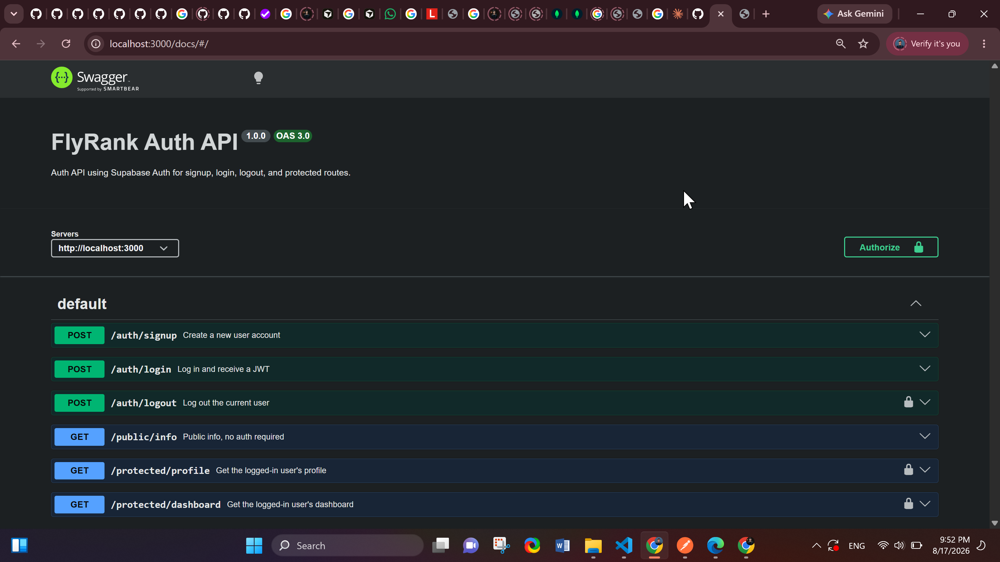

# FlyRank Auth API

Secure API for FlyRank Internship · Backend Track · W2 · A4 — Auth: Login & protect.

Built with Node.js, Express, and Supabase Auth. Supabase manages accounts, password hashing, and
JWT signing; this server verifies tokens and guards protected routes. No password is ever stored
or hashed by this codebase — that's Supabase's job.

## Stack

- Node.js + Express (ES modules)
- Supabase Auth (Identity Provider)
- dotenv for environment variables
- swagger-ui-express for interactive API docs

## Setup

1. Clone this repo and install dependencies:
```bash
   git clone <this-repo-url>
   cd flyrank-auth
   npm install
```

2. Create a free project at [supabase.com](https://supabase.com) (no credit card needed).

3. In your Supabase Dashboard, go to **Project Settings → API** and copy your **Project URL** and
   **anon key** (never the `service_role` key — it bypasses all security).

4. Copy `.env.example` to `.env` and fill in your values:
```bash
   cp .env.example .env
```
5. In your Supabase Dashboard, go to **Authentication → Sign In / Providers → Email** and turn
   **off** "Confirm email" so test signups can log in immediately. (In production you'd leave this on.)

## Run

```bash
npm start
```

Server starts on `http://localhost:3000`. Interactive API docs (Swagger UI) are at
`http://localhost:3000/docs`.

## API Reference

| Method | Route | Auth required | Description |
|--------|-------|:---:|-------------|
| POST | `/auth/signup` | No | Create a new user account |
| POST | `/auth/login` | No | Authenticate and receive a JWT |
| POST | `/auth/logout` | Yes | End the current user's session |
| GET | `/protected/profile` | Yes | Read the logged-in user's profile |
| GET | `/protected/dashboard` | Yes | Read the logged-in user's dashboard |
| GET | `/public/info` | No | Open, public data |

Protected routes require an `Authorization: Bearer <access_token>` header. The token is returned
by `/auth/login` and verified against Supabase on every request via the shared `requireAuth`
middleware (`src/middleware/authMiddleware.js`).

### Status codes

| Code | Meaning |
|------|---------|
| 200 | Success (login, profile read, etc.) |
| 201 | User created (signup) |
| 204 | Logout successful, no content |
| 400 | Bad request — missing email/password |
| 401 | Missing, malformed, invalid, or expired token |

## Swagger UI

`/docs` renders all endpoints with a padlock icon on protected routes. Click **Authorize**, paste
a raw access token (no `Bearer` prefix), and use **Try it out** to call any endpoint directly from
the browser.


## Security notes

- Passwords are never touched, stored, or hashed by this code — Supabase Auth handles that entirely.
- `.env` is git-ignored and was never committed; only `.env.example` (placeholder values) is tracked.
- Tokens are verified against Supabase on every protected request (`supabase.auth.getUser(token)`),
  not just decoded locally — so a tampered or forged token is always rejected.

